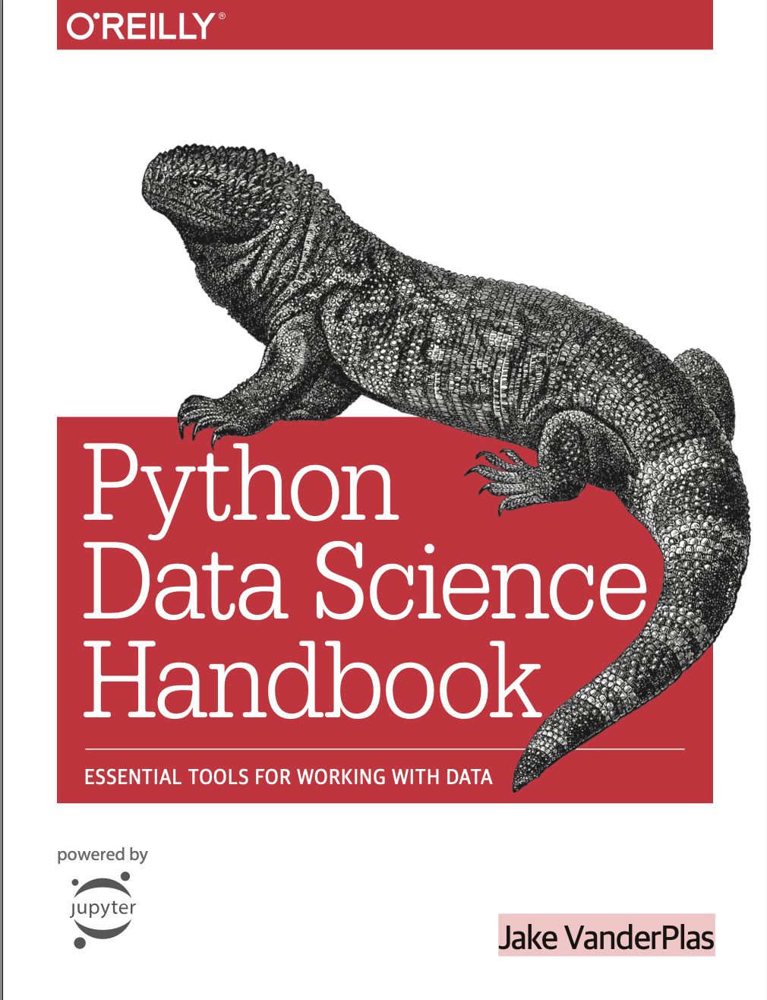

## Overview
This is a side project I undertook to learn more about Large Language Models (LLMs) and specifically Retrieval-Augmented Generation (RAG). The goal was to create an AI assistant that leverages the *Python Data Science Handbook* by Jake VanderPlas to deepen my knowledge of Data Science. Using RAG in this project allows the LLM to retrieve information exclusively from the handbook, ensuring that the generated responses are relevant and can be validated for correctness. This was a particularly enjoyable project because I knew the source of the responses and could verify their accuracy.

## Project Stages

### Creating the Database
1. **Data Preparation**: The dataset used is the *Python Data Science Handbook*, chosen to ensure the LLM generates answers solely from this book. Markdown files for each chapter of the book were selected.
2. **Splitting the Data**: The data is split into smaller chunks of text to facilitate easy retrieval.

### Retrieving Relevant Information
1. **Vector Database**: A vector database is created to store word embeddings of the text chunks.
2. **Similarity Function**: When a query is run, such as "What is bias-variance tradeoff?", the system scans the vector database to find similar chunks of text using a similarity function, primarily cosine similarity.
3. **Top Chunks**: The top K most relevant chunks are retrieved to help the LLM generate an answer.

### Generation
The LLM takes the query and the relevant chunks of text to create a prompt and generate a response.

## How to Use
1. **Run a Query**: On your terminal, run:
    ```bash
    python query_data.py "What is bias-variance tradeoff?"
    ```
2. **Sample Response**:
    ```text
    Response: Bias-variance tradeoff refers to the balance between underfitting (high bias) and overfitting (high variance) in machine learning models. High bias occurs when a model is too simple and fails to capture the underlying patterns in the data, while high variance occurs when a model is too complex and captures noise in the data as well. Finding the right balance between bias and variance is crucial for developing an accurate and generalizable model.

    Sources: ['data/Chapter_5_Machine_Learning.md', 'data/Chapter_5_Machine_Learning.md', 'data/Chapter_5_Machine_Learning.md']
    ```
    The metadata includes the sources, so you know which chapter the LLM is retrieving information from.

## Installation
 1. **Dependencies**:
    ```bash
    pip install -r requirements.txt
    ```
2. **Markdown Support**:
    ```bash
    pip install "unstructured[md]"
    ```



